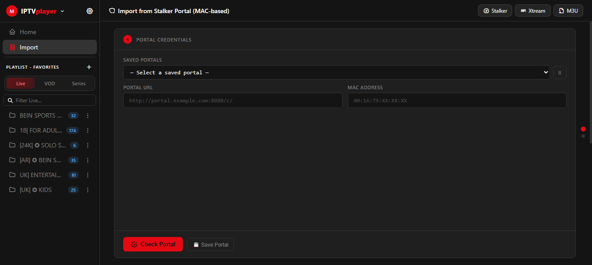
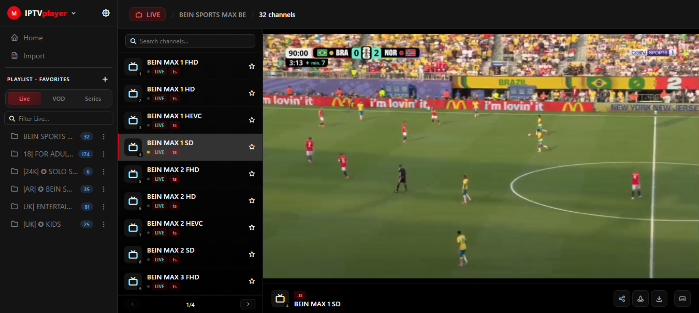
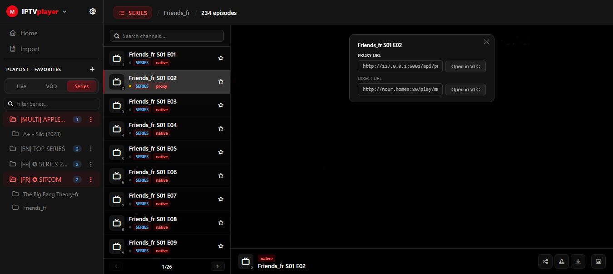

# IPTV Suite

<p align="center">
  
  
  
</p>

IPTV Suite is a self-hosted, single-app solution for managing and watching IPTV content. It pulls together everything you'd normally need several tools for — importing from Stalker (MAC-based) portals, Xtream Codes panels, or plain M3U files/URLs, organizing everything into playlists, browsing Live/VOD/Series content, favoriting categories, converting/proxying streams on the fly, and handing playback off to VLC — all wrapped in a clean, Netflix-inspired dark interface.


---

## ✨ Features

- **Multi-source playlist import**
  - Stalker (MAC-based) portal support
  - Xtream Codes API support
  - M3U import from a **file upload** or a **remote URL**
  - Auto-refresh on startup for URL-based playlists
- **Playlist management** — add, edit, delete, and organize multiple playlists side by side
- **Live / VOD / Series** browsing with category and search filters
- **Favorites management** — manage and save individual categories to a dedicated Favorites playlist
- **Built-in player** with subtitle support (`.srt` / `.vtt`)
- **Stream conversion & proxy** — on-the-fly stream conversion with pause/resume/stop control
- **Streaming**: Built-in player with HLS/MPEG-TS support — open any stream directly in VLC
- **Dark, Netflix-style theme** with a light-theme toggle


## 🖥️ Screenshots

Import Page


Player Page


Open In Vlc



## 🚀 Getting Started

### Requirements
- Python 3.9+
- pip

### Installation

```bash
git clone https://github.com/Slimk-Code/iptv-suite.git
cd iptv-suite
pip install -r requirements.txt
```

### Run

```bash
python app.py
```

The app starts on **http://localhost:5000**.


## 📁 Project Structure

```
.
├── app.py                 # Flask backend — playlist sources, conversion, VLC bridge
├── static/
│   └── index.html         # Single-page frontend (UI + client-side logic)
├── PlayLists/              # Saved playlists (JSON), including Favorites.json
├── portals.json            # Saved Stalker portal credentials
├── settings.json            # App settings
└── requirements.txt
```

## 🔧 Configuration

- Playlists you add through the UI are saved under `PlayLists/*.json`. 
- Stalker portal credentials are stored in `portals.json`. 
- No external database is required — everything is file-based.

## 🗺️ Roadmap

- Some Features are present in the UI but not yet wired up 


## 📄 License

MIT — do whatever you like with it, just don't hold the author liable for how you use it. 
